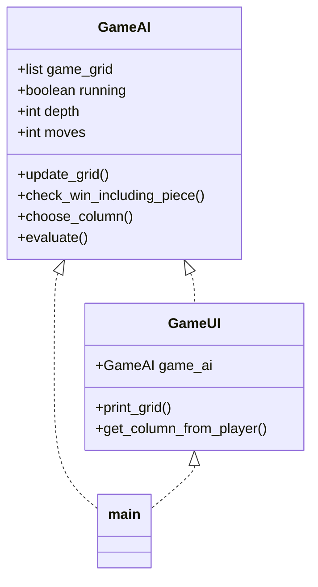

# Implementation Document

## Project Structure

The application is split into three parts: Graphical User Interface, AI and the main file running the game loop. A separate directory has been made for unit testing, and another test file for performance testing is located together with the main file.

## Implemented time and space complexities

Currently the time complexity of the minimax function is O^n,where n is the depth reached by minimax, as expected. For each iteration of the minimax algorithm, it recursively calls itself multiple times during each depth level. The space complexity is O(7^n), where n is the depth of the minimax calculation, since the game grid is duplicated into a "fake grid" with each minimax iteration to explore possible all possible game states.

## Flaws and possible improvements

The heuristic evaluation of different game states is very minimal, only evaluating the amount of 3-in-a-rows, but current attempts to sophisticate it have reduced the depth reached by the minimax algorithm with iterative deepening. However with the addition of move ordering and transposition tables, sophisticating heuristics could possibly improve the performance of the algorithm.

The algorithm could be refined to make it possible for the computer to play with either pieces.

Currently, the game_state variable is stored as a "list" with the game board at index 0, last dropped piece's row number at index 1 and the piece's column number at index 2. This is slightly clunky, and the plan was to refactor this into separate variables, but I couldn't implement it in time.

The user experience could also be improved in a number of ways:

* The user interface could be made more legible, for example by swapping the numbers on the board into characters like 'X' and 'O'.
* The player could be provided with multiple difficulty options, such as by limiting the maximum depth of the minimax function.

## Sources
* Course material for minimax: https://tiralabra.github.io/2023_alkukesa/fi/aiheet/minimax.pdf
* Wikipedia articles:
    * https://en.wikipedia.org/wiki/Minimax
    * https://en.wikipedia.org/wiki/Alpha%E2%80%93beta_pruning
    * https://en.wikipedia.org/wiki/Iterative_deepening_depth-first_search
