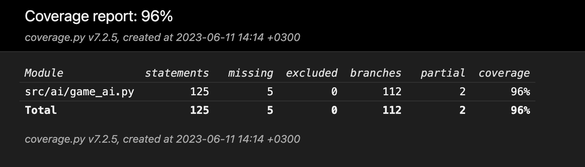
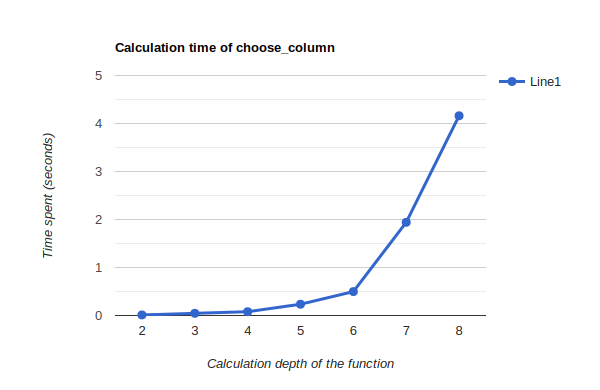

# Testing document

## Unit testing

Unit tests currently test that the AI correctly picks columns that would either win the game for it or prevent it from losing. They also test that the victory checking function works correctly.

### Testing coverage

## Performance testing

As the only scaling variable in the program is the depth of the minimax queries, the time taken for the AI to choose a move is measured by the code in src/minimax_performance.py. Please note that this test currently always assumes an empty game board, so the times may vary with different game states.

The measurements are done with the assistance of the Python Library timeit, which executes the AI-class's method "choose_column" 100 times, and prints out the average time taken to choose a move.

These tests were performed on a 2,7 GHz Dual-Core Intel Core i5 processor running on macOS Monterey. The hardware is relatively old, so performance may improve on a more modern device. The tests can be replicated after installing the necessary poetry dependencies with the command

`poetry run invoke test-performance`

Here are the current results:

|Minimax Depth|Time taken to choose column (s)|Testing Day|
|-|-|-|
|2|0.01176432135000141|11.6.2023|
|3|0.04542365977999907|11.6.2023|
|4|0.0789036874600015|11.6.2023|
|5|0.235107686299998|11.6.2023|
|6|0.4979836556100008|11.6.2023|
|7|1.9416485094700011|11.6.2023|
|8|4.160757938810002|11.6.2023|

Currently the time complexity of the algorithm seems to be O^n, as expected of the minimax-algorithm.

Worth noting is that the minimax algorithm doesn't reach victory or loss states on the board at lower depths, and the current heuristic for determining the "value" of a board state is not complete. As the heuristics improve, we may see changes in the results, though I don't expect dramatic changes.
